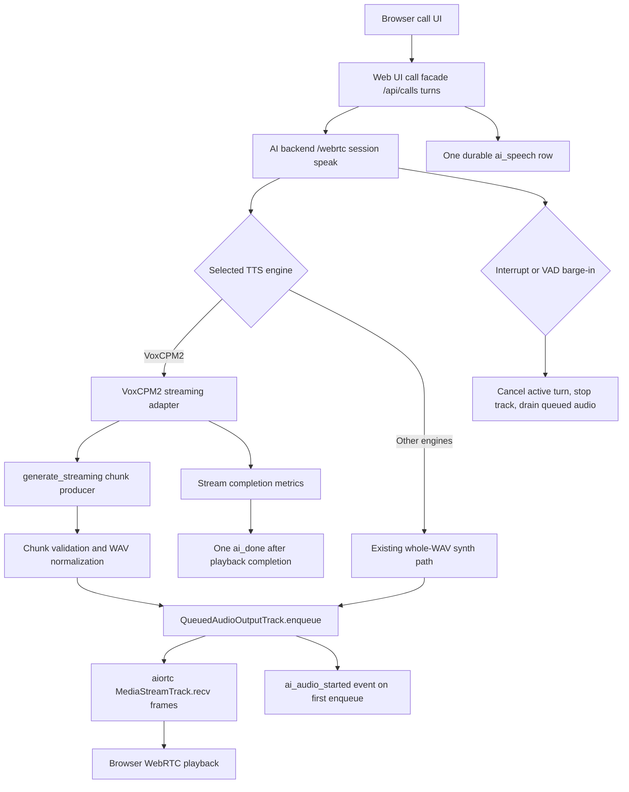

# Phase 08: Wire VoxCPM2 Streaming Chunks Into Live RayMe Call Playback - Research

**Researched:** 2026-05-11 [VERIFIED: environment current_date]  
**Domain:** AI backend streaming TTS, WebRTC audio playout, live-call evidence, and durable engine-decision writeback [VERIFIED: .planning/phases/08-wire-voxcpm2-streaming-chunks-into-live-rayme-call-playback/08-SPEC.md]  
**Confidence:** HIGH [VERIFIED: codebase inspection + official VoxCPM/aiortc docs + package registry checks]

<user_constraints>
## User Constraints (from CONTEXT.md)

All content in this section is copied from `08-CONTEXT.md` so the planner can honor locked decisions before any implementation planning. [VERIFIED: .planning/phases/08-wire-voxcpm2-streaming-chunks-into-live-rayme-call-playback/08-CONTEXT.md]

### Locked Decisions

## Implementation Decisions

### Streaming Boundary
- **D-01:** Build a reusable internal TTS streaming contract inside the AI backend, with VoxCPM2 as the first real implementation. Do not add a VoxCPM2-specific browser API or expose runtime internals outside the AI backend.
- **D-02:** Preserve the existing public RayMe call surfaces where possible: Web UI/browser callers still use the normal call facade and AI backend `/webrtc` call routes.
- **D-03:** Non-streaming engines may continue using the existing whole-WAV path unless a small shared interface adapter is needed to keep call-session code coherent.

### Playback Timing
- **D-04:** Optimize for first-audio latency. Enqueue the first viable VoxCPM2 streaming chunk as soon as it can produce valid playable audio.
- **D-05:** Use only a minimal viability floor for chunk playback: reject empty/invalid chunks and apply necessary format/sample-rate normalization, but do not intentionally wait for full-response smoothing.
- **D-06:** Measure first chunk time, first enqueue time, `ai_audio_started` time, chunk count, total generation/playback time, inter-chunk gaps, and whether any fallback occurred.

### Call Completion Contract
- **D-07:** Keep the AI backend speak request open until streamed playback reaches the same completion point as current call playback. This preserves the existing Web UI SSE keepalive and Android Chrome connection behavior.
- **D-08:** Emit `ai_audio_started` when the first streamed chunk is queued, not after full VoxCPM2 generation finishes.
- **D-09:** Emit exactly one final completion for the AI turn. Streaming chunks are a playback detail and must not create multiple `ai_done` events or multiple durable `ai_speech` rows.

### Failure And Fallback Policy
- **D-10:** Evidence runs must not silently fall back to whole-WAV synthesis. If streaming is unavailable or not used, the evidence artifact must show that clearly and cannot satisfy the Phase 8 pass gate.
- **D-11:** In production behavior, fallback is allowed only before first audio starts and only if it is explicit in events/evidence. After first audio starts, streaming failure should stop future chunks, emit sanitized `call_tts_failed` behavior as appropriate, and avoid duplicate completion events.
- **D-12:** Interrupt and VAD barge-in must cancel pending VoxCPM2 generation, prevent later chunk enqueue, stop/drain queued speech through the existing interrupt path, and return to listening.

### Evidence Strictness
- **D-13:** Same-run warm comparison is required, but use repeated warm samples and promote based on median VoxCPM2 warm first-audio time beating median F5 warm first-audio time.
- **D-14:** The evidence artifact must include enough timing fields to prove first audio came from live streaming playback rather than whole-WAV completion.
- **D-15:** Durable default/preferred-engine writeback occurs only if live evidence passes the comparative latency gate and preserves call-flow, interrupt, sanitized-error, VRAM/runtime, and single-turn semantics.

### Claude's Discretion

- Exact internal class/interface names for streaming chunks and adapters.
- Exact chunk viability thresholds, as long as they are minimal and latency-first.
- Exact evidence filenames and schema shape, as long as required metrics are machine-readable and verifier-enforced.
- Exact test layering and fixture design, as long as tests prove first-chunk enqueue before final generation completion and interrupt behavior after the first streamed chunk.

### Deferred Ideas (OUT OF SCOPE)

None - discussion stayed within Phase 8 scope.

</user_constraints>

## Summary

Phase 8 is best planned as an AI-backend-first streaming playback change: add a reusable internal streaming TTS contract, implement VoxCPM2 `generate_streaming(...)` behind that contract, and teach `CallSession.speak_text()` to enqueue the first valid chunk before final generation completes while preserving the existing `/webrtc` speak route and Web UI call facade. [VERIFIED: 08-CONTEXT.md + ai-backend/app/models/tts_voxcpm2.py + ai-backend/app/call/session.py + VoxCPM API docs]

The current blocker is not VoxCPM2 availability; it is the live call path waiting for one complete WAV before outbound WebRTC audio is queued. [VERIFIED: .planning/phases/08-wire-voxcpm2-streaming-chunks-into-live-rayme-call-playback/08-SPEC.md + ai-backend/app/models/tts_voxcpm2.py + ai-backend/app/call/session.py] Phase 7 recorded live VoxCPM2 warm call TTFA at `14425.6 ms` and F5 at `1117.1 ms`, while benchmark-only VoxCPM2 streaming chunks appeared around `381-399 ms`; Phase 8 evidence must prove that benchmark advantage now reaches live RayMe playback. [VERIFIED: 08-SPEC.md + .planning/phases/07-add-voxcpm2-to-the-tts-roster-with-empirical-quality-latency/results/voxcpm2-call-flow.json + .planning/phases/07-add-voxcpm2-to-the-tts-roster-with-empirical-quality-latency/results/voxcpm2-scenario-matrix.json]

**Primary recommendation:** Build a sync VoxCPM2 chunk producer around `generate_streaming(...)`, bridge it into async call playback with an `asyncio.Queue`, enqueue each valid chunk through the existing `QueuedAudioOutputTrack.enqueue(...)`, emit `ai_audio_started` on the first enqueue, keep `/webrtc/.../speak` open until playback completion, and gate decision writeback on repeated same-run median evidence versus F5. [VERIFIED: 08-CONTEXT.md + codebase inspection + https://voxcpm.readthedocs.io/en/latest/reference/api.html]

## Architectural Responsibility Map

| Capability | Primary Tier | Secondary Tier | Rationale |
|------------|--------------|----------------|-----------|
| VoxCPM2 streaming chunk generation | AI Backend | GPU runtime on OMEN | `VoxCpm2TtsAdapter` owns VoxCPM2 runtime calls and currently calls `runtime.generate(...)`; official VoxCPM exposes `generate_streaming(...)` as the incremental API. [VERIFIED: ai-backend/app/models/tts_voxcpm2.py + https://voxcpm.readthedocs.io/en/latest/reference/api.html] |
| Chunk viability and WAV/sample-rate normalization | AI Backend | Existing `soundfile` decoder/encoder helpers | The call track accepts WAV bytes today, and `soundfile` is already used for VoxCPM2 output serialization and queued-track decoding. [VERIFIED: ai-backend/app/models/tts_voxcpm2.py + ai-backend/app/call/tracks.py] |
| First-audio event timing | AI Backend call session | Web UI SSE pass-through | `CallSession.speak_text()` currently emits `ai_audio_started` after outbound enqueue; Web UI already forwards nested `ai_audio_started_event` from the backend speak result. [VERIFIED: ai-backend/app/call/session.py + web-ui/server/app/api/calls.py + web-ui/server/tests/test_calls.py] |
| WebRTC audio playout | AI Backend media track | Browser WebRTC receiver | `QueuedAudioOutputTrack` is the outbound audio track and implements `recv()` for aiortc audio frames. [VERIFIED: ai-backend/app/call/tracks.py + https://aiortc.readthedocs.io/en/latest/api.html?highlight=createOffer] |
| Durable AI speech row | Web UI server | AI Backend speak task | `web-ui/server/app/api/calls.py` records one `ai_speech` row after LLM completion and before asking the AI backend to speak the text. [VERIFIED: web-ui/server/app/api/calls.py] |
| Interrupt and barge-in cancellation | AI Backend call session | Web UI control route | `cancel_ai_turn()` cancels the active task, stops the outbound track, drains buffered outbound audio, and emits interruption state. [VERIFIED: ai-backend/app/call/session.py] |
| Same-run evidence and decision writeback | Planning/evidence tooling | AI Backend/Web UI runtime | Phase 8 acceptance requires machine-readable live evidence and updates to `PROJECT.md`, `.planning/STATE.md`, `.planning/ROADMAP.md`, and a Phase 8 decision artifact only if the evidence passes. [VERIFIED: 08-SPEC.md] |

## Phase Requirements (from SPEC.md)

| ID | Description | Research Support |
|----|-------------|------------------|
| P8-R1 | VoxCPM2 live playback must enqueue the first viable streaming chunk before full generation completes. | Official VoxCPM docs expose `generate_streaming(...)`, and current RayMe call code already has a single enqueue/event lifecycle point to adapt. [VERIFIED: 08-SPEC.md + https://voxcpm.readthedocs.io/en/latest/reference/api.html + ai-backend/app/call/session.py] |
| P8-R2 | VoxCPM2 warm live first-audio must beat F5 warm live first-audio in the same evidence run. | Phase 7 evidence provides the baseline regression target and the benchmark-only streaming potential; Phase 8 must measure live first enqueue/`ai_audio_started`, not HTTP speak completion. [VERIFIED: 08-SPEC.md + Phase 7 evidence artifacts + web-ui/server/app/api/calls.py] |
| P8-R3 | Interrupt and VAD barge-in must cancel in-flight streamed VoxCPM2 playback without duplicate completions or raw errors. | The existing cancellation path already stops the outbound track and drains queued audio; the streaming consumer must check cancellation before every chunk enqueue. [VERIFIED: ai-backend/app/call/session.py + 08-SPEC.md] |
| P8-R4 | Streaming chunks must preserve one visible/durable AI call turn per LLM response. | The durable `ai_speech` write occurs once in the Web UI server before backend TTS, so planner should avoid per-chunk Web UI persistence. [VERIFIED: web-ui/server/app/api/calls.py + 08-SPEC.md] |
| P8-R5 | Passing evidence must update durable project/default wording toward VoxCPM2. | SPEC acceptance requires `PROJECT.md`, `.planning/STATE.md`, `.planning/ROADMAP.md`, and Phase 8 evidence/decision artifacts to agree after a pass. [VERIFIED: 08-SPEC.md] |

## Project Constraints (from AGENTS.md)

| Constraint | Planning Impact |
|------------|-----------------|
| OMEN deployment must use only `scripts/deploy-omen.sh`. [VERIFIED: AGENTS.md] | Any OMEN evidence task must call or fix the canonical deploy script and must not create ad-hoc deploy scripts or manually edit scheduled tasks. [VERIFIED: AGENTS.md + scripts/deploy-omen.sh] |
| The canonical OMEN launchers are `start-ai-backend.cmd` and `start-web-ui.cmd`, both written by `deploy-omen.sh`. [VERIFIED: AGENTS.md] | Planner should not add alternate launcher files under `C:\Users\pmpg\rayme\` outside the script. [VERIFIED: AGENTS.md] |
| Scheduled tasks `RayMePhase1AI` and `RayMePhase1Web` must point to those canonical launcher files only. [VERIFIED: AGENTS.md] | Runtime verification can inspect scheduled-task behavior only through the canonical deployment path. [VERIFIED: AGENTS.md] |
| No `CLAUDE.md` exists in the repository root. [VERIFIED: test -f CLAUDE.md] | There are no additional `CLAUDE.md` directives to merge into planning. [VERIFIED: repository inspection] |
| No `.claude/skills` or `.agents/skills` directory was found. [VERIFIED: repository inspection] | There are no project-local skill patterns to apply beyond AGENTS.md and existing code conventions. [VERIFIED: repository inspection] |

## Standard Stack

### Core

| Library | Version | Purpose | Why Standard |
|---------|---------|---------|--------------|
| `voxcpm` | Project pins `2.0.2`; PyPI latest checked as `2.0.3` published 2026-05-11. [VERIFIED: ai-backend/pyproject.toml + PyPI JSON] | VoxCPM2 model runtime and `generate_streaming(...)` API. [CITED: https://voxcpm.readthedocs.io/en/latest/reference/api.html] | Keep the Phase 7-proven `2.0.2` pin for Phase 8 unless a separate upgrade/evidence task is planned, because the project runtime and deployment evidence were established against that pin. [VERIFIED: ai-backend/pyproject.toml + Phase 7 evidence artifacts] |
| `aiortc` | Project pins `1.14.0`; PyPI latest checked as `1.14.0` published 2025-10-13. [VERIFIED: ai-backend/pyproject.toml + PyPI JSON] | WebRTC session and custom audio track transport. [CITED: https://aiortc.readthedocs.io/en/latest/api.html?highlight=createOffer] | Existing call playback already uses an aiortc `MediaStreamTrack` implementation, so streaming should feed that track instead of replacing WebRTC plumbing. [VERIFIED: ai-backend/app/call/tracks.py] |
| `soundfile` | Project pins `0.13.1`; PyPI latest checked as `0.13.1` published 2025-01-25. [VERIFIED: ai-backend/pyproject.toml + PyPI JSON] | WAV encoding/decoding for TTS outputs and outbound queue input. [VERIFIED: ai-backend/app/models/tts_voxcpm2.py + ai-backend/app/call/tracks.py] | It is already the project standard for converting waveform arrays to WAV bytes and decoding queued WAV bytes. [VERIFIED: codebase inspection] |
| `numpy` | Project pins `2.2.6`; PyPI latest checked as `2.4.4` published 2026-03-29. [VERIFIED: ai-backend/pyproject.toml + PyPI JSON] | VoxCPM waveform chunk validation and concatenation-compatible array handling. [CITED: https://voxcpm.readthedocs.io/en/latest/reference/api.html] | VoxCPM streaming chunks are documented as 1-D waveform chunks, and the existing code already depends on NumPy arrays for audio conversion. [CITED: https://voxcpm.readthedocs.io/en/latest/reference/api.html] |
| `FastAPI` | Project pins `0.136.1`; PyPI latest checked as `0.136.1` published 2026-04-23. [VERIFIED: ai-backend/pyproject.toml + PyPI JSON] | AI backend `/webrtc` HTTP routes and speak endpoint. [VERIFIED: ai-backend/app/api/webrtc.py] | Phase 8 should preserve `/webrtc` call routes instead of adding browser-facing VoxCPM2 routes. [VERIFIED: 08-CONTEXT.md] |

### Supporting

| Library/Tool | Version | Purpose | When to Use |
|--------------|---------|---------|-------------|
| `pytest` | Project pins `9.0.3`; PyPI latest checked as `9.0.3` published 2026-04-07. [VERIFIED: ai-backend/pyproject.toml + web-ui/server/pyproject.toml + PyPI JSON] | AI backend and Web UI server tests. [VERIFIED: pyproject files + tests directories] | Use for streaming adapter, call-session, WebRTC speak, Web UI SSE, and evidence verifier tests. [VERIFIED: existing test files] |
| `httpx` | Project pins `0.28.1`; PyPI latest checked as `0.28.1` published 2024-12-06. [VERIFIED: ai-backend/pyproject.toml + web-ui/server/pyproject.toml + PyPI JSON] | Backend/client HTTP tests and evidence calls. [VERIFIED: test and client code inspection] | Use for evidence tooling and server tests that invoke the existing speak/call routes. [VERIFIED: web-ui/server/app/domain/ai_backend_client.py + Phase 7 evidence scripts] |
| `uv` | Local version `0.11.6`. [VERIFIED: uv --version] | Python dependency sync and test runner. [VERIFIED: pyproject files + deploy script] | Use local `uv run --project ...` for tests and let `deploy-omen.sh` manage OMEN runtime sync. [VERIFIED: scripts/deploy-omen.sh] |
| `SvelteKit` | Project pins `@sveltejs/kit 2.58.0`; npm latest checked as `2.59.1`. [VERIFIED: web-ui/client/package.json + npm registry] | Browser UI/call facade. [VERIFIED: web-ui/client/package.json] | Touch only if streaming changes require browser-facing call behavior; locked decisions prefer preserving current surfaces. [VERIFIED: 08-CONTEXT.md] |

### Alternatives Considered

| Instead of | Could Use | Tradeoff |
|------------|-----------|----------|
| Internal AI-backend streaming contract | Browser-visible VoxCPM2 streaming API | Reject this for Phase 8 because D-01 explicitly forbids exposing VoxCPM2 runtime internals outside the AI backend. [VERIFIED: 08-CONTEXT.md] |
| Per-chunk WAV bytes into existing `QueuedAudioOutputTrack.enqueue(...)` | Replace the audio track with a new stream primitive | The existing track already decodes WAV bytes and emits WebRTC audio frames; replacing it would increase call playout risk without being required by Phase 8. [VERIFIED: ai-backend/app/call/tracks.py] |
| Keep `voxcpm==2.0.2` | Upgrade to `voxcpm==2.0.3` | `2.0.3` is newer in PyPI, but Phase 7 runtime evidence and the current lock are tied to `2.0.2`; upgrade requires separate runtime/evidence validation. [VERIFIED: PyPI JSON + ai-backend/pyproject.toml + Phase 7 evidence artifacts] |

**Installation:** No new package installation is required for the planned streaming implementation. [VERIFIED: ai-backend/pyproject.toml + codebase inspection]

```bash
uv sync --project ai-backend --extra tts
uv sync --project web-ui/server
npm --prefix web-ui/client install
```

**Version verification commands used:** Package versions above were checked with PyPI JSON, npm registry, and local CLI version commands before writing this research. [VERIFIED: command execution]

```bash
npm view @sveltejs/kit version time.modified
uv --version
python3 --version
```

## Architecture Patterns

### System Architecture Diagram

This diagram reflects verified current call flow plus the recommended Phase 8 streaming insertion point. [VERIFIED: ai-backend/app/call/session.py + ai-backend/app/models/tts_voxcpm2.py + web-ui/server/app/api/calls.py]



### Recommended Project Structure

Use existing modules instead of creating a new service boundary. [VERIFIED: codebase inspection + 08-CONTEXT.md]

```text
ai-backend/app/models/
  tts_registry.py      # streaming protocol/types next to existing synthesis protocol
  tts_voxcpm2.py       # VoxCPM2 generate_streaming implementation
ai-backend/app/call/
  session.py           # streaming playback lifecycle and events
  tracks.py            # existing enqueue/playout boundary; small stats additions only if needed
ai-backend/tests/
  test_tts_voxcpm2.py
  test_call_session.py
  test_webrtc_signaling.py
web-ui/server/tests/
  test_calls.py        # only if response/event shape changes
.planning/phases/08-wire-voxcpm2-streaming-chunks-into-live-rayme-call-playback/
  08-run-call-flow-evidence.py
  08-verify-evidence.py
  results/
```

### Pattern 1: Internal Streaming TTS Contract

**What:** Add a reusable internal streaming output type and an optional streaming adapter protocol alongside the existing `TtsAdapter.synthesize(...)` protocol. [VERIFIED: ai-backend/app/models/tts_registry.py]  
**When to use:** Use this path only when the selected engine supports native incremental audio and call playback needs first-audio latency improvement. [VERIFIED: 08-CONTEXT.md + ai-backend/app/models/tts_registry.py]

```python
# Source: ai-backend/app/models/tts_registry.py and VoxCPM generate_streaming docs.
# [VERIFIED: ai-backend/app/models/tts_registry.py]
# [CITED: https://voxcpm.readthedocs.io/en/latest/reference/api.html]
@dataclass(frozen=True)
class TtsAudioChunk:
    chunk_index: int
    wav_bytes: bytes
    sample_rate: int
    duration_ms: float
    generated_at_ms: float

class TtsStreamingAdapter(Protocol):
    def stream(self, request: TtsSynthesisInput) -> Iterator[TtsAudioChunk]:
        ...
```

### Pattern 2: Sync Generator To Async Playback Bridge

**What:** Run the blocking VoxCPM generator in a worker thread and push chunks into an `asyncio.Queue` using the event loop, so the call session can enqueue audio as chunks arrive. [ASSUMED]  
**When to use:** Use this bridge because VoxCPM `generate_streaming(...)` is documented as a normal generator and the current call session is asynchronous. [CITED: https://voxcpm.readthedocs.io/en/latest/reference/api.html] [VERIFIED: ai-backend/app/call/session.py]

```python
# Source: existing async CallSession lifecycle and VoxCPM's generator API.
# [VERIFIED: ai-backend/app/call/session.py]
# [CITED: https://voxcpm.readthedocs.io/en/latest/reference/api.html]
async def consume_streaming_tts(adapter, request, enqueue_chunk, is_cancelled):
    loop = asyncio.get_running_loop()
    queue: asyncio.Queue[object] = asyncio.Queue()
    sentinel = object()

    def produce() -> None:
        try:
            for chunk in adapter.stream(request):
                if is_cancelled():
                    break
                loop.call_soon_threadsafe(queue.put_nowait, chunk)
        except Exception as exc:
            loop.call_soon_threadsafe(queue.put_nowait, exc)
        finally:
            loop.call_soon_threadsafe(queue.put_nowait, sentinel)

    task = asyncio.create_task(asyncio.to_thread(produce))
    try:
        while True:
            item = await queue.get()
            if item is sentinel:
                break
            if isinstance(item, Exception):
                raise item
            if is_cancelled():
                break
            await enqueue_chunk(item)
    finally:
        await task
```

### Pattern 3: First Enqueue Defines First Audio

**What:** Treat the first successful `QueuedAudioOutputTrack.enqueue(...)` call for a streamed chunk as the `ai_audio_started` boundary. [VERIFIED: 08-CONTEXT.md + ai-backend/app/call/session.py + ai-backend/app/call/tracks.py]  
**When to use:** Use this for evidence and events because the current whole-WAV path emits `ai_audio_started` after outbound audio is queued. [VERIFIED: ai-backend/app/call/session.py]

```python
# Source: CallSession.speak_text() already queues outbound audio before ai_audio_started.
# [VERIFIED: ai-backend/app/call/session.py]
if first_chunk:
    enqueue_started_ms = elapsed_ms()
    duration_ms = await self._queue_outbound_audio(chunk.wav_bytes, ai_turn_id=ai_turn_id)
    await emit_ai_audio_started(
        first_chunk_generated_ms=chunk.generated_at_ms,
        first_chunk_enqueued_ms=elapsed_ms(),
        chunk_count_started=1,
    )
else:
    duration_ms = await self._queue_outbound_audio(chunk.wav_bytes, ai_turn_id=ai_turn_id)
```

### Anti-Patterns to Avoid

- **Collecting all chunks before enqueue:** Calling `list(runtime.generate_streaming(...))` or concatenating all chunks before playback repeats the whole-WAV latency failure. [CITED: https://voxcpm.readthedocs.io/en/latest/reference/api.html] [VERIFIED: ai-backend/app/models/tts_voxcpm2.py + 08-SPEC.md]
- **Per-chunk `ai_done` or durable rows:** Streaming chunks are playback detail and must not create multiple final events or multiple `ai_speech` rows. [VERIFIED: 08-CONTEXT.md + web-ui/server/app/api/calls.py]
- **Browser-visible VoxCPM2 internals:** D-01 explicitly keeps the streaming contract internal to the AI backend. [VERIFIED: 08-CONTEXT.md]
- **Fallback that evidence treats as success:** D-10 requires evidence to fail if streaming is unavailable or unused. [VERIFIED: 08-CONTEXT.md]
- **Preroll on every chunk:** The current queue supports a preroll argument; applying it to every chunk would add repeated silence and inflate inter-chunk gaps. [VERIFIED: ai-backend/app/call/tracks.py] [ASSUMED]

## Don't Hand-Roll

| Problem | Don't Build | Use Instead | Why |
|---------|-------------|-------------|-----|
| WebRTC audio transport | Custom RTP/WebRTC sender | Existing aiortc `QueuedAudioOutputTrack` | The project already has an outbound audio track that `recv()`s frames for aiortc. [VERIFIED: ai-backend/app/call/tracks.py + https://aiortc.readthedocs.io/en/latest/api.html?highlight=createOffer] |
| WAV parsing and encoding | Manual RIFF/WAV byte assembly | `soundfile` and existing queue decode path | Existing VoxCPM2 and track code already uses `soundfile` for WAV serialization/decoding. [VERIFIED: ai-backend/app/models/tts_voxcpm2.py + ai-backend/app/call/tracks.py] |
| Browser-level streaming TTS protocol | New VoxCPM2-specific browser API | Internal AI-backend streaming protocol | D-01 and D-02 require preserving public call surfaces where possible. [VERIFIED: 08-CONTEXT.md] |
| OMEN deployment | Ad-hoc scripts, manual scheduled-task edits, hidden process launchers | `scripts/deploy-omen.sh` | AGENTS.md declares that script the only valid OMEN deployment path. [VERIFIED: AGENTS.md] |
| Evidence pass/fail logic | Manual interpretation of logs | Machine-readable Phase 8 verifier | SPEC and D-10/D-14 require artifacts with enforced streaming proof fields. [VERIFIED: 08-SPEC.md + 08-CONTEXT.md] |

**Key insight:** The hard problem is not media transport; it is moving the first valid VoxCPM2 waveform chunk across the existing async call-session lifecycle without breaking cancellation, single-final-event, or durable-message semantics. [VERIFIED: codebase inspection + 08-SPEC.md]

## Common Pitfalls

### Pitfall 1: Using `asyncio.to_thread()` Around Full Synthesis Only

**What goes wrong:** The event loop stays responsive, but no audio is enqueued until `synthesize(...)` returns one complete WAV. [VERIFIED: ai-backend/app/call/session.py + ai-backend/app/models/tts_voxcpm2.py]  
**Why it happens:** Current `CallSession` uses `_synthesize_speech(...)` as a whole-result boundary. [VERIFIED: ai-backend/app/call/session.py]  
**How to avoid:** Add a chunk producer/consumer path that emits each valid chunk to playback as it arrives. [CITED: https://voxcpm.readthedocs.io/en/latest/reference/api.html]  
**Warning signs:** Evidence reports low model streaming time but high live call TTFA, or `ai_audio_started` occurs only after generation completion. [VERIFIED: Phase 7 evidence artifacts + 08-SPEC.md]

### Pitfall 2: Measuring `/webrtc/.../speak` HTTP Completion As TTFA

**What goes wrong:** D-07 keeps the speak request open until streamed playback completion, so request duration becomes completion-ish rather than first-audio timing. [VERIFIED: 08-CONTEXT.md + web-ui/server/app/api/calls.py]  
**Why it happens:** Phase 7 evidence used blocking speak request timing for the whole-WAV path, where completion and first enqueue were coupled. [VERIFIED: Phase 7 evidence scripts + Phase 7 call-flow artifact]  
**How to avoid:** Record first chunk generation, first enqueue, and `ai_audio_started` offsets inside the backend response/evidence while the request remains open. [VERIFIED: 08-CONTEXT.md]  
**Warning signs:** VoxCPM2 TTFA numbers remain close to total playback/generation time after streaming is implemented. [ASSUMED]

### Pitfall 3: Duplicate Final Events Or Per-Chunk Durable Messages

**What goes wrong:** Captions/history fragment into one AI turn per audio chunk, or clients receive multiple `ai_done` events. [VERIFIED: 08-SPEC.md]  
**Why it happens:** Treating chunks as semantic turns instead of audio playout units crosses the Web UI server and AI backend responsibility boundary. [VERIFIED: web-ui/server/app/api/calls.py + ai-backend/app/call/session.py]  
**How to avoid:** Keep Web UI persistence unchanged and emit one final completion after all streamed playback reaches the same completion point as current playback. [VERIFIED: 08-CONTEXT.md]  
**Warning signs:** `web-ui/server/tests/test_calls.py` or call evidence shows multiple `ai_speech` rows for one LLM response. [VERIFIED: web-ui/server/tests/test_calls.py + 08-SPEC.md]

### Pitfall 4: Silent Whole-WAV Fallback In Evidence

**What goes wrong:** Evidence can appear to pass call-flow behavior while not proving live streaming playback. [VERIFIED: 08-CONTEXT.md]  
**Why it happens:** Production fallback before first audio is allowed, but D-10 forbids treating fallback as a Phase 8 pass. [VERIFIED: 08-CONTEXT.md]  
**How to avoid:** Evidence schema must include `streaming_used`, `fallback_used`, `whole_wav_fallback_used`, chunk count, and first-chunk timing fields, and verifier must fail when streaming is absent. [VERIFIED: 08-CONTEXT.md + 08-SPEC.md]  
**Warning signs:** Evidence lacks chunk count or cannot prove `ai_audio_started` happened before final chunk completion. [VERIFIED: 08-SPEC.md]

### Pitfall 5: Interrupt Races With Late Chunks

**What goes wrong:** A chunk generated after barge-in may enqueue into a cancelled AI turn. [VERIFIED: 08-SPEC.md]  
**Why it happens:** VoxCPM streaming generation is a blocking generator from the call session's perspective, and Python thread cancellation is cooperative. [CITED: https://voxcpm.readthedocs.io/en/latest/reference/api.html] [ASSUMED]  
**How to avoid:** Store a cancellation token/turn id, check it before every enqueue, stop the outbound track through the existing interrupt path, and discard late chunks. [VERIFIED: ai-backend/app/call/session.py + 08-CONTEXT.md]  
**Warning signs:** Tests see audio enqueue after `cancel_ai_turn()` or duplicate `ai_done` after interrupt. [VERIFIED: ai-backend/tests/test_call_session.py + 08-SPEC.md]

### Pitfall 6: Accidental Runtime Upgrade

**What goes wrong:** Upgrading `voxcpm` from the project pin to PyPI latest can invalidate Phase 7 runtime assumptions during a streaming-only phase. [VERIFIED: ai-backend/pyproject.toml + PyPI JSON + Phase 7 evidence artifacts]  
**Why it happens:** PyPI latest is `2.0.3` while the project pin is `2.0.2`. [VERIFIED: PyPI JSON + ai-backend/pyproject.toml]  
**How to avoid:** Keep `2.0.2` unless the plan explicitly adds upgrade smoke, VRAM, latency, and deploy evidence. [VERIFIED: Phase 7 evidence artifacts + scripts/deploy-omen.sh]  
**Warning signs:** Lockfile or deploy output shows `voxcpm==2.0.3` without a planned runtime-evidence update. [ASSUMED]

### Pitfall 7: OMEN Deployment Blocked By Dirty Remote Checkout

**What goes wrong:** `scripts/deploy-omen.sh` refuses deployment when the OMEN checkout has uncommitted changes. [VERIFIED: scripts/deploy-omen.sh + ssh rayme-pmpg git status]  
**Why it happens:** The script checks remote cleanliness before updating the target repo. [VERIFIED: scripts/deploy-omen.sh]  
**How to avoid:** Plan an explicit preflight step to inspect and resolve the remote dirty checkout before live OMEN evidence. [VERIFIED: environment audit]  
**Warning signs:** OMEN remote status includes modified Phase 7 artifacts and untracked runtime files. [VERIFIED: ssh rayme-pmpg git status]

## Code Examples

Verified patterns from official sources and local codebase:

### VoxCPM2 Streaming Runtime Call

```python
# Source: VoxCPM API reference documents generate_streaming() as the same interface
# as generate(), returning a generator of 1-D float32 waveform chunks.
# [CITED: https://voxcpm.readthedocs.io/en/latest/reference/api.html]
chunks = []
for chunk in model.generate_streaming(text="Streaming output."):
    chunks.append(chunk)
wav = np.concatenate(chunks)
sample_rate = model.tts_model.sample_rate
```

### Existing Call Playback Boundary

```python
# Source: current CallSession.speak_text() queues outbound audio and then emits
# ai_audio_started in the same call-session lifecycle.
# [VERIFIED: ai-backend/app/call/session.py]
duration_ms = await self._queue_outbound_audio(wav_bytes, ai_turn_id=ai_turn_id)
await self._emit_event({"type": "ai_audio_started", "ai_turn_id": ai_turn_id})
await self._wait_for_outbound_playback()
await self._emit_event({"type": "ai_done", "final": True})
```

### Existing Track Interface To Preserve

```python
# Source: QueuedAudioOutputTrack is already the playout boundary for WAV bytes.
# [VERIFIED: ai-backend/app/call/tracks.py]
duration_ms = await outbound_audio_track.enqueue(wav_bytes, preroll_seconds=0.0)
```

### Evidence Timing Shape

```json
{
  "engine": "voxcpm2",
  "streaming_used": true,
  "fallback_used": false,
  "first_chunk_generated_ms": 390.4,
  "first_chunk_enqueued_ms": 410.8,
  "ai_audio_started_ms": 412.1,
  "chunk_count": 8,
  "whole_wav_fallback_used": false,
  "speak_http_total_ms": 2860.0
}
```

The example schema is a recommended Phase 8 artifact shape, not an existing artifact. [ASSUMED]

## State of the Art

| Old Approach | Current Approach For Phase 8 | When Changed | Impact |
|--------------|------------------------------|--------------|--------|
| Wait for VoxCPM2 `runtime.generate(...)` to return a complete WAV before enqueue. [VERIFIED: ai-backend/app/models/tts_voxcpm2.py + ai-backend/app/call/session.py] | Use `runtime.generate_streaming(...)` and enqueue the first valid chunk immediately through the existing outbound track. [CITED: https://voxcpm.readthedocs.io/en/latest/reference/api.html] | Planned for Phase 8. [VERIFIED: 08-SPEC.md] | Moves live first-audio timing from whole-generation completion toward first playable chunk generation. [VERIFIED: 08-SPEC.md + Phase 7 evidence artifacts] |
| Treat Phase 7 benchmark streaming evidence as non-promotional. [VERIFIED: Phase 7 promotion decision + 08-SPEC.md] | Require same-run live call evidence where VoxCPM2 warm median first-audio beats F5 warm median first-audio. [VERIFIED: 08-CONTEXT.md] | Locked on 2026-05-11. [VERIFIED: 08-CONTEXT.md] | Prevents promoting VoxCPM2 based on benchmark-only streaming behavior. [VERIFIED: 08-CONTEXT.md] |
| Use `/speak` request duration as a proxy for call TTFA. [VERIFIED: Phase 7 evidence scripts] | Record first chunk, first enqueue, and `ai_audio_started` timing separately while `/speak` remains open until playback completion. [VERIFIED: 08-CONTEXT.md] | Planned for Phase 8. [VERIFIED: 08-SPEC.md] | Avoids confusing playback completion with first audible audio. [VERIFIED: web-ui/server/app/api/calls.py + 08-CONTEXT.md] |

**Deprecated/outdated for this phase:**
- Treating VoxCPM2 as a whole-WAV-only live call engine is outdated because official VoxCPM exposes `generate_streaming(...)` and Phase 8 is explicitly scoped to consume those chunks live. [CITED: https://voxcpm.readthedocs.io/en/latest/reference/api.html] [VERIFIED: 08-SPEC.md]
- Treating benchmark-only streaming collection as sufficient is out of scope and explicitly rejected by Phase 8. [VERIFIED: 08-SPEC.md]

## Assumptions Log

| # | Claim | Section | Risk if Wrong |
|---|-------|---------|---------------|
| A1 | A worker-thread producer plus `asyncio.Queue` is the lowest-risk bridge from VoxCPM's sync generator into the async call session. | Architecture Patterns | Planner may choose a different internal bridge, but it must still stream chunks without collecting the full response first. |
| A2 | Applying preroll to every chunk would add repeated silence and inflate inter-chunk gaps. | Anti-Patterns | Planner should verify current preroll behavior before implementing first-chunk-only preroll. |
| A3 | Python thread cancellation for the VoxCPM generator is cooperative from this integration's perspective. | Common Pitfalls | Planner should design interrupt behavior around discard-after-cancel even if runtime calls finish late. |
| A4 | The example evidence JSON schema is recommended, not an existing artifact. | Code Examples | Planner may choose another schema if it preserves verifier-enforced required fields. |

## Open Questions

1. **Remote OMEN checkout cleanup before evidence**
   - What we know: The OMEN alias `rayme-pmpg` is reachable, the target GPU is an RTX 3060 with 12288 MiB VRAM and driver 560.94, and the remote RayMe checkout currently has modified Phase 7 artifacts plus untracked runtime files. [VERIFIED: ssh rayme-pmpg whoami + ssh rayme-pmpg nvidia-smi + ssh rayme-pmpg git status]
   - What's unclear: Whether those remote changes are disposable generated evidence or user-preserved work. [ASSUMED]
   - Recommendation: Add a preflight task that reports the remote dirty checkout and asks for cleanup/commit direction before `scripts/deploy-omen.sh` live evidence. [VERIFIED: scripts/deploy-omen.sh + AGENTS.md]

2. **Whether to expose first-audio metrics in backend speak response or data-channel events**
   - What we know: Web UI already forwards nested `ai_audio_started_event` if present, and the backend speak request must remain open until playback completion. [VERIFIED: web-ui/server/app/api/calls.py + 08-CONTEXT.md]
   - What's unclear: The exact evidence transport is discretionary as long as fields are machine-readable and verifier-enforced. [VERIFIED: 08-CONTEXT.md]
   - Recommendation: Prefer backend response metrics for minimal public-surface change, with data-channel collection only if existing evidence tooling already relies on live events. [ASSUMED]

## Environment Availability

| Dependency | Required By | Available | Version | Fallback |
|------------|-------------|-----------|---------|----------|
| Python 3 | Local tests/evidence scripts | Yes [VERIFIED: python3 --version] | `3.12.3` [VERIFIED: python3 --version] | None needed locally. [VERIFIED: environment audit] |
| `uv` | Python dependency sync/test runner | Yes [VERIFIED: uv --version] | `0.11.6` [VERIFIED: uv --version] | Use project/deploy script sync path if OMEN lacks local `uv`. [VERIFIED: scripts/deploy-omen.sh] |
| Node.js | Web UI client tests if touched | Yes [VERIFIED: node --version] | `v22.22.2` [VERIFIED: node --version] | Skip client tests only if no client files change. [VERIFIED: 08-CONTEXT.md] |
| npm | Web UI client package/test runner | Yes [VERIFIED: npm --version] | `10.9.7` [VERIFIED: npm --version] | Skip client tests only if no client files change. [VERIFIED: 08-CONTEXT.md] |
| Local NVIDIA GPU | Local VoxCPM runtime evidence | No [VERIFIED: command -v nvidia-smi] | Not available locally. [VERIFIED: command -v nvidia-smi] | Run runtime/live evidence on OMEN through `scripts/deploy-omen.sh`. [VERIFIED: AGENTS.md + scripts/deploy-omen.sh] |
| OMEN SSH alias `rayme-pmpg` | Target deployment/evidence | Yes [VERIFIED: ssh rayme-pmpg whoami] | User `omen-pc\pmpg`. [VERIFIED: ssh rayme-pmpg whoami] | None for SSH access. [VERIFIED: environment audit] |
| OMEN GPU | Live VoxCPM2 evidence | Yes [VERIFIED: ssh rayme-pmpg nvidia-smi] | `NVIDIA GeForce RTX 3060`, `12288 MiB`, driver `560.94`. [VERIFIED: ssh rayme-pmpg nvidia-smi] | None; this is the target runtime. [VERIFIED: .planning/OPERATING-NOTES.md + environment audit] |
| OMEN repo cleanliness | `deploy-omen.sh` preflight | No [VERIFIED: ssh rayme-pmpg git status] | Remote checkout has modified Phase 7 artifacts and untracked runtime/evidence files. [VERIFIED: ssh rayme-pmpg git status] | Planner must include cleanup/decision step before deployment. [VERIFIED: scripts/deploy-omen.sh] |

**Missing dependencies with no fallback:**
- Local GPU runtime evidence is unavailable because local `nvidia-smi` is not installed; live VoxCPM2 evidence must run on OMEN. [VERIFIED: command -v nvidia-smi + .planning/OPERATING-NOTES.md]
- OMEN deployment is blocked until the remote dirty checkout is addressed, because `deploy-omen.sh` refuses dirty remote worktrees. [VERIFIED: scripts/deploy-omen.sh + ssh rayme-pmpg git status]

**Missing dependencies with fallback:**
- Local `python` command is absent, but `python3` is present and usable for local scripts. [VERIFIED: command -v python + python3 --version]

## Validation Architecture

### Test Framework

| Property | Value |
|----------|-------|
| AI backend framework | `pytest==9.0.3` with async tests already present. [VERIFIED: ai-backend/pyproject.toml + ai-backend/tests] |
| Web UI server framework | `pytest==9.0.3` and `pytest-asyncio==1.3.0`. [VERIFIED: web-ui/server/pyproject.toml] |
| Web UI client framework | `vitest==4.1.5` and `@playwright/test==1.59.1`. [VERIFIED: web-ui/client/package.json + npm registry] |
| Config file | No dedicated pytest config was found in inspected root files; tests are organized under project test directories. [VERIFIED: repository inspection] |
| Quick AI backend run | `uv run --project ai-backend pytest ai-backend/tests/test_tts_voxcpm2.py ai-backend/tests/test_call_session.py ai-backend/tests/test_webrtc_signaling.py -q` [VERIFIED: existing test files] |
| Quick Web UI server run | `uv run --project web-ui/server pytest web-ui/server/tests/test_calls.py -q` [VERIFIED: existing test files] |
| Client run if touched | `npm --prefix web-ui/client run test:unit` [VERIFIED: web-ui/client/package.json] |
| Evidence verifier run | `python3 .planning/phases/08-wire-voxcpm2-streaming-chunks-into-live-rayme-call-playback/08-verify-evidence.py` after planner creates the verifier. [VERIFIED: Phase 7 verifier pattern + 08-SPEC.md] |

### Phase Requirements To Test Map

| Req ID | Behavior | Test Type | Automated Command | File Exists? |
|--------|----------|-----------|-------------------|--------------|
| P8-R1 | First streamed VoxCPM2 chunk enqueue and `ai_audio_started` happen before scripted final chunk completion. [VERIFIED: 08-SPEC.md] | Unit/integration | `uv run --project ai-backend pytest ai-backend/tests/test_call_session.py ai-backend/tests/test_tts_voxcpm2.py -q` [VERIFIED: existing test files] | Partial; extend existing files. [VERIFIED: repository inspection] |
| P8-R2 | Warm VoxCPM2 live first-audio beats warm F5 in same-run evidence with streaming proof fields. [VERIFIED: 08-SPEC.md] | Evidence/integration | `python3 .../08-run-call-flow-evidence.py && python3 .../08-verify-evidence.py` [VERIFIED: Phase 7 evidence script pattern] | No; Wave 0 gap. [VERIFIED: repository inspection] |
| P8-R3 | Interrupt after first chunk prevents later chunk enqueue and duplicate `ai_done`. [VERIFIED: 08-SPEC.md] | Unit/integration | `uv run --project ai-backend pytest ai-backend/tests/test_call_session.py ai-backend/tests/test_webrtc_signaling.py -q` [VERIFIED: existing test files] | Partial; extend existing files. [VERIFIED: repository inspection] |
| P8-R4 | Streamed response persists one durable `ai_speech` row and one visible text turn. [VERIFIED: 08-SPEC.md] | Server integration | `uv run --project web-ui/server pytest web-ui/server/tests/test_calls.py -q` [VERIFIED: existing test files] | Partial; extend if server shape changes. [VERIFIED: repository inspection] |
| P8-R5 | Passing evidence updates project decision/default wording. [VERIFIED: 08-SPEC.md] | Evidence/docs verification | `python3 .../08-verify-evidence.py --decision-ready` after planner creates it. [VERIFIED: Phase 7 verifier pattern] | No; Wave 0 gap. [VERIFIED: repository inspection] |

### Sampling Rate

- **Per task commit:** Run the relevant quick test command for files changed in that task. [VERIFIED: existing test layout]
- **Per wave merge:** Run AI backend quick suite plus Web UI server call tests. [VERIFIED: existing test layout]
- **Phase gate:** Run OMEN live evidence through `scripts/deploy-omen.sh`, Phase 8 evidence runner, Phase 8 verifier, and changed unit/integration tests before `/gsd-verify-work`. [VERIFIED: AGENTS.md + 08-SPEC.md + scripts/deploy-omen.sh]

### Wave 0 Gaps

- [ ] Add or extend `ai-backend/tests/test_tts_voxcpm2.py` to cover `generate_streaming` chunk validation, sample-rate extraction, empty/invalid chunk rejection, and no fallback during evidence mode. [VERIFIED: existing test file + 08-SPEC.md]
- [ ] Extend `ai-backend/tests/test_call_session.py` to prove first enqueue before final chunk completion, first `ai_audio_started` timing, single `ai_done`, and interrupt-after-first-chunk discard. [VERIFIED: existing test file + 08-SPEC.md]
- [ ] Extend `ai-backend/tests/test_webrtc_signaling.py` if speak-route response metrics or sanitized streaming failures change. [VERIFIED: existing test file + ai-backend/app/api/webrtc.py]
- [ ] Extend `web-ui/server/tests/test_calls.py` only if nested backend event/response shape changes for SSE keepalive or `ai_audio_started` forwarding. [VERIFIED: existing test file + web-ui/server/app/api/calls.py]
- [ ] Create `.planning/phases/08-wire-voxcpm2-streaming-chunks-into-live-rayme-call-playback/08-run-call-flow-evidence.py`, `08-verify-evidence.py`, and `results/` artifacts by mirroring Phase 7 evidence patterns. [VERIFIED: Phase 7 evidence scripts + 08-SPEC.md]

## Security Domain

OWASP ASVS is an official verification standard for web application technical security controls, and the current stable version is 5.0.0 as of the OWASP page checked during research. [CITED: https://owasp.org/www-project-application-security-verification-standard/] The GSD template requests V2/V3/V4/V5/V6-style rows, so this table maps Phase 8 controls into those planning buckets rather than asserting current ASVS 5 chapter numbering. [VERIFIED: GSD research template]

### Applicable ASVS Categories

| ASVS Category | Applies | Standard Control |
|---------------|---------|------------------|
| V2 Authentication | No new auth scope. [VERIFIED: 08-SPEC.md] | Preserve existing call route assumptions; do not add auth changes in Phase 8. [VERIFIED: 08-SPEC.md] |
| V3 Session Management | Existing call-session IDs apply, but no web-auth session change is in scope. [VERIFIED: ai-backend/app/api/webrtc.py + 08-SPEC.md] | Preserve existing WebRTC session lookup and interrupt semantics. [VERIFIED: ai-backend/app/api/webrtc.py + ai-backend/app/call/session.py] |
| V4 Access Control | No new user/role access-control feature is in scope. [VERIFIED: 08-SPEC.md] | Do not create new browser-facing VoxCPM2 runtime routes. [VERIFIED: 08-CONTEXT.md] |
| V5 Input Validation | Yes. [VERIFIED: 08-SPEC.md] | Keep existing reference-audio size limits and bounded VoxCPM2 options; reject invalid/empty chunks internally. [VERIFIED: ai-backend/app/models/tts_registry.py + ai-backend/app/api/webrtc.py + 08-CONTEXT.md] |
| V6 Cryptography | No new cryptography scope. [VERIFIED: 08-SPEC.md] | Do not hand-roll crypto; continue existing LAN/HTTPS deployment assumptions. [VERIFIED: .planning/OPERATING-NOTES.md + 08-SPEC.md] |

### Known Threat Patterns For This Stack

| Pattern | STRIDE | Standard Mitigation |
|---------|--------|---------------------|
| Raw model/runtime error disclosure | Information Disclosure | Continue sanitized `call_tts_failed` behavior and prevent tracebacks, paths, cache paths, or raw internals from browser-visible payloads. [VERIFIED: 08-SPEC.md + ai-backend/app/api/webrtc.py + web-ui/server/app/domain/ai_backend_client.py] |
| Oversized reference audio or unbounded VoxCPM2 options | Denial of Service | Preserve existing request validation, reference-size checks, and bounded `TtsSynthesisInput` fields. [VERIFIED: ai-backend/app/models/tts_registry.py + ai-backend/app/api/webrtc.py] |
| Late chunk enqueue after interrupt | Tampering | Check active turn/cancellation state before every streamed chunk enqueue and drain through existing interrupt path. [VERIFIED: ai-backend/app/call/session.py + 08-CONTEXT.md] |
| False-positive evidence through fallback | Repudiation | Record and verify `streaming_used`, `fallback_used`, and first-chunk timing fields; fail evidence if streaming is absent. [VERIFIED: 08-CONTEXT.md + 08-SPEC.md] |
| CPU fallback in production model path | Elevation of runtime regression risk | Keep CUDA-only model runtime checks and OMEN evidence requirements. [VERIFIED: ai-backend/app/models/tts_voxcpm2.py + ai-backend/docs/STT-GPU-RUNTIME.md + 08-SPEC.md] |

## Sources

### Primary (HIGH confidence)

- `.planning/phases/08-wire-voxcpm2-streaming-chunks-into-live-rayme-call-playback/08-CONTEXT.md` - locked implementation decisions, evidence policy, and discretion areas. [VERIFIED: file read]
- `.planning/phases/08-wire-voxcpm2-streaming-chunks-into-live-rayme-call-playback/08-SPEC.md` - locked goal, requirements, boundaries, constraints, and acceptance criteria. [VERIFIED: file read]
- `AGENTS.md` - OMEN deployment and subagent sequencing rules. [VERIFIED: file read]
- `ai-backend/app/models/tts_voxcpm2.py` - current VoxCPM2 whole-WAV adapter, runtime loading, CUDA assertion, and `soundfile` serialization. [VERIFIED: code read]
- `ai-backend/app/models/tts_registry.py` - TTS input/output protocol, bounded VoxCPM2 options, and `supports_streaming` metadata. [VERIFIED: code read]
- `ai-backend/app/call/session.py` - speak lifecycle, outbound enqueue, events, cancellation, and playback wait. [VERIFIED: code read]
- `ai-backend/app/call/tracks.py` - `QueuedAudioOutputTrack.enqueue(...)` and aiortc audio frame output. [VERIFIED: code read]
- `web-ui/server/app/api/calls.py` - one durable `ai_speech` row, SSE keepalive, nested `ai_audio_started` forwarding, and backend speak task behavior. [VERIFIED: code read]
- `https://voxcpm.readthedocs.io/en/latest/reference/api.html` - official VoxCPM `generate(...)` and `generate_streaming(...)` API, chunk type, and sample-rate note. [CITED: official docs]
- `https://aiortc.readthedocs.io/en/latest/api.html?highlight=createOffer` - official aiortc `MediaStreamTrack.recv()` API. [CITED: official docs]
- `scripts/deploy-omen.sh` - canonical OMEN deployment behavior and dirty-remote preflight. [VERIFIED: code read]

### Secondary (MEDIUM confidence)

- PyPI JSON registry checks for `voxcpm`, `fastapi`, `aiortc`, `soundfile`, `numpy`, `pytest`, and `httpx`. [VERIFIED: registry query]
- npm registry checks for `@sveltejs/kit`, `@playwright/test`, `vitest`, `svelte`, and `vite`. [VERIFIED: registry query]
- Context7 CLI lookup for `/openbmb/voxcpm` and `/aiortc/aiortc` documentation snippets. [VERIFIED: Context7 CLI]
- `https://owasp.org/www-project-application-security-verification-standard/` - ASVS purpose and 5.0.0 current stable version. [CITED: official docs]

### Tertiary (LOW confidence)

- None. [VERIFIED: sources review]

## Metadata

**Confidence breakdown:**
- Standard stack: HIGH - recommended packages are already present in project manifests and versions were checked against registries. [VERIFIED: pyproject/package files + registry checks]
- Architecture: HIGH - responsibility boundaries are directly visible in current AI backend, Web UI server, and Phase 8 locked decisions. [VERIFIED: codebase inspection + 08-CONTEXT.md]
- Pitfalls: HIGH for event/fallback/evidence issues because they come from locked decisions and current code; MEDIUM for thread-bridge mechanics because the exact internal implementation remains discretionary. [VERIFIED: 08-CONTEXT.md + codebase inspection] [ASSUMED]
- Environment: HIGH for local and OMEN probes executed during research; MEDIUM for remote cleanup implications because the owner of remote uncommitted files is unknown. [VERIFIED: command execution] [ASSUMED]

**Research date:** 2026-05-11 [VERIFIED: environment current_date]  
**Valid until:** 2026-06-10 for package/runtime guidance; refresh registry and OMEN status before executing live evidence. [ASSUMED]
