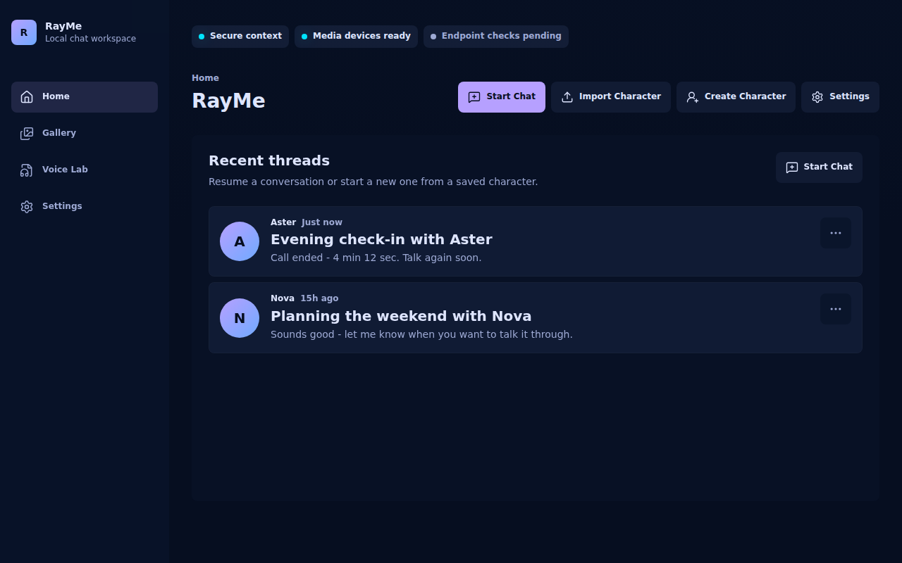
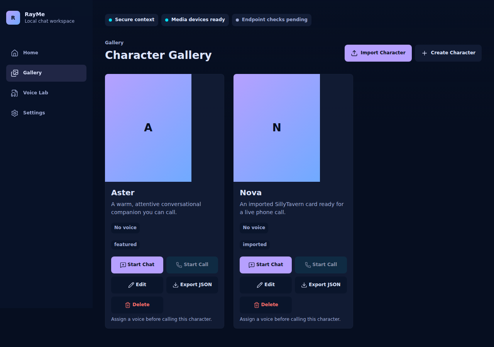

# RayMe

**A self-hosted live phone-call simulator for AI characters** — full-duplex voice
calls with barge-in and live captions, not a generated-audio player.

## What it is

RayMe is a self-hosted web app that lets you have AI conversations that feel like
real phone calls. You import or create characters (SillyTavern v2/v3 character
cards), clone voices from short audio samples, and then **call** them.

Calls run full-duplex: you can speak over the AI and it stops to listen (barge-in
via voice-activity detection), and live bidirectional captions show both your
speech-to-text and the AI's response as the call happens. Every chat thread holds
both typed messages and call transcripts interleaved, so you can switch between
texting and calling the same character without losing the conversation.

The phone-call framing is load-bearing. A fix that waits for the full assistant
response or full TTS generation before first playback is explicitly not an
acceptable call experience — live calls must stay live.

## Architecture

RayMe is three services that are configured independently and connect over your
LAN. No assumption is made that they share a host — the GPU box, the web host,
and the LLM can each live on a different machine.

- **`web-ui/`** — the user-facing app. A SvelteKit client plus a FastAPI server
  that owns characters, chat, threads, voices, and settings, and brokers calls
  to the AI backend over same-origin `/api/*` routes.
- **`ai-backend/`** — a FastAPI service for the real-time audio work: STT, the
  TTS engines, voice-activity detection, and WebRTC call sessions.
- **An OpenAI-compatible LLM server** — any Chat Completions endpoint, whether
  the official OpenAI API or a local server such as `llama-server`. See `llm/`.

## Tech stack

- **Backend:** Python (managed with `uv`), FastAPI, WebRTC (`aiortc`).
- **Frontend:** SvelteKit + TypeScript, served as a static-adapter SPA.
- **Testing:** Playwright for browser end-to-end coverage, pytest for the
  Python services.
- **TTS engines:** F5-TTS, XTTS v2, Qwen3-TTS 0.6B-Base, and VoxCPM2 — selectable
  per voice. VoxCPM2 is the default live-call engine; F5-TTS is the fallback and
  comparator.
- **STT:** faster-whisper, tuned for accented English.
- **VAD:** Silero VAD for barge-in.
- **Target hardware:** the AI backend is optimized for a single NVIDIA RTX 3060
  (12 GB VRAM); STT, TTS, and VAD model choices fit that budget together.

## Status / scope

RayMe is a personal project. It is intentionally narrow in v1:

- **Single user, LAN-only.** No authentication — LAN-level trust is sufficient.
- **English-only** for STT and TTS (Spanish-accented English is a concrete
  quality bar). Bilingual support is out of scope for v1.
- No multi-user/multi-tenant support, no cloud or internet-facing hosting, and
  no native mobile apps — the responsive web app covers mobile via Chrome on
  Android.

## Running it

Each service is configured and run from its own directory rather than through a
single combined script. Start in the per-service directories:

- `web-ui/` — the SvelteKit client (`web-ui/client/`) and FastAPI server
  (`web-ui/server/`).
- `ai-backend/` — the STT/TTS/VAD/WebRTC service.
- `llm/` — see `llm/README.md` and `llm/openai-compatible.example.env` for
  pointing RayMe at an OpenAI-compatible LLM endpoint.

## License

See [`LICENSES.md`](LICENSES.md) at the repository root. Note that TTS engines
and model weights carry their own separate licenses — engine package/code
licenses are distinct from model/weights licenses.
