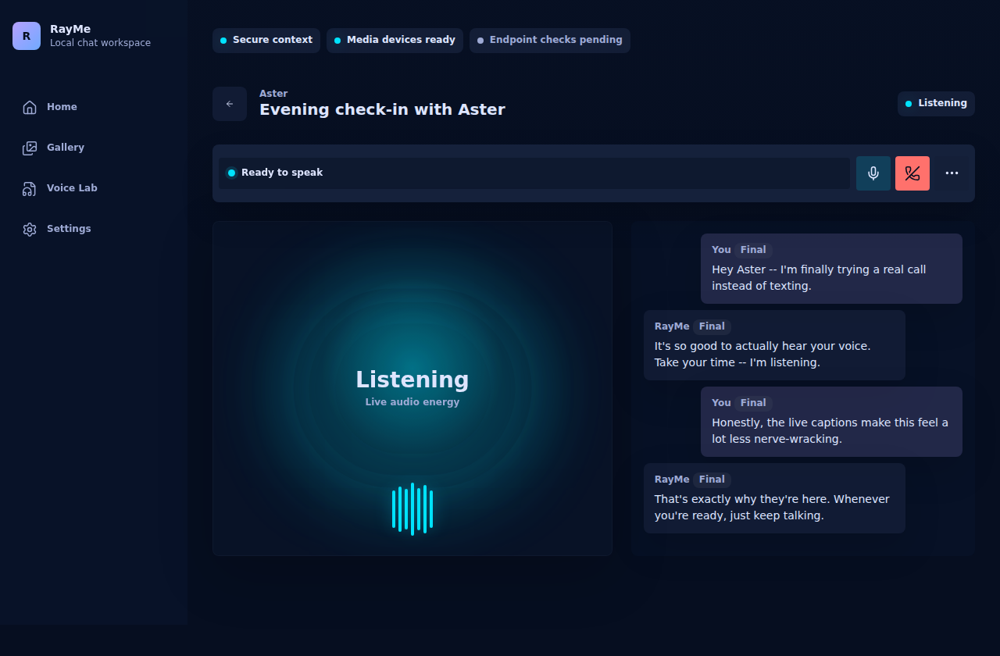

<!-- generated-by: gsd-doc-writer -->
# RayMe

RayMe is a self-hosted LAN web app for talking to AI characters by text chat or by live phone-style voice calls.



## What RayMe Does

RayMe is built around one product promise: a call should feel like a real phone call, not like a chatbot that generated an audio file after the fact.

You can:

- Import or create SillyTavern v2/v3 character cards.
- Upload short voice samples in Voice Lab, transcribe them, edit the transcript, and save reusable voices.
- Start text chats and live calls from the same character thread.
- Run full-duplex browser calls with WebRTC, voice activity detection, barge-in, live captions, and durable call transcript rows.
- Point the app at any OpenAI-compatible Chat Completions endpoint, including the official OpenAI API or a local server.

RayMe is intentionally scoped as a single-user, LAN-only personal system. There is no authentication layer in this repository; LAN trust is the security boundary for the current product shape.


## Architecture

RayMe is three independently configured services. They do not have to run on the same machine.

```text
Browser
  |
  | HTTPS, same-origin /api/*
  v
web-ui/
  SvelteKit client + FastAPI server
  - characters, portraits, voices, threads, messages, settings
  - SQLite storage and blob storage
  - server-side bridge to AI backend and LLM
  |
  | HTTPS to configured backend
  v
ai-backend/
  FastAPI AI runtime
  - /health
  - /stt/transcribe
  - /tts/synthesize
  - /webrtc/*
  - STT, VAD, TTS engines, call sessions

External OpenAI-compatible LLM
  - Chat Completions streaming endpoint
```

The browser talks to the Web UI server. The Web UI server owns durable state and keeps LLM credentials server-side. The AI backend owns real-time audio work: STT, VAD, TTS, and WebRTC call sessions.

## Repository Layout

```text
ai-backend/        FastAPI STT/TTS/VAD/WebRTC service
web-ui/client/    SvelteKit 5 client
web-ui/server/    FastAPI API, static client host, SQLite storage, Alembic migrations
llm/              OpenAI-compatible LLM configuration notes
scripts/          LAN/OMEN operational scripts
docs/             HTTPS, source notes, Stitch design docs, screenshots
LICENSES.md       Project and model/license notes
AGENTS.md         Workspace operating rules for agents
```

## Tech Stack

- Frontend: SvelteKit 5, TypeScript, Vite, static adapter.
- Web server: Python 3.12, FastAPI, SQLAlchemy async, Alembic, SQLite.
- AI backend: Python 3.11, FastAPI, aiortc, faster-whisper, Silero VAD.
- Package managers: `npm` for the client, `uv` for Python services.
- Tests: Vitest, Playwright, pytest.
- TTS registry: F5-TTS, XTTS v2, Qwen3-TTS 0.6B-Base, LuxTTS, Chatterbox Turbo, TADA 1B, and VoxCPM2. The current code default is `f5`; other engines are selectable when their runtime dependencies and evidence gates are available.

## Prerequisites

- Node.js and npm for `web-ui/client`.
- `uv` for `web-ui/server` and `ai-backend`.
- Python 3.12 for the Web UI server.
- Python 3.11 for the AI backend.
- LAN HTTPS certificate material for browser microphone/WebRTC use outside localhost. Existing runbooks use mkcert-style certs under `.local/phase1-tls/` or `C:\Users\pmpg\rayme\phase1-tls\`.
- NVIDIA CUDA runtime on the AI backend host for production STT/TTS paths. CPU fallback for production AI model runtime is treated as a regression.

## Install

From the repository root:

```bash
npm --prefix web-ui/client ci
uv sync --project web-ui/server
uv sync --project ai-backend
```

For real TTS runtime dependencies on the AI backend, sync the optional TTS extra:

```bash
uv sync --project ai-backend --extra tts
```

On Windows GPU hosts, CUDA PyTorch wheels may need to be installed after `uv sync`; `scripts/deploy-omen.sh` contains the canonical OMEN path for that.

## Configure

Use the checked-in examples as shell environment templates. The Python services read `os.environ` directly; they do not automatically load `.env` files.

```bash
cp web-ui/server/config.example.env web-ui/server/.env.local
cp llm/openai-compatible.example.env llm/.env.local
# Edit the copied files for your LAN IP, cert paths, and LLM endpoint, then export/source them in your shell.
```

The Web UI server reads these environment variables:

| Variable | Default | Purpose |
| --- | --- | --- |
| `RAYME_WEB_BIND_HOST` | `127.0.0.1` | Explicit host/IP for the Web UI HTTPS server. `0.0.0.0` is rejected. |
| `RAYME_WEB_PORT` | `8443` | Web UI HTTPS port. |
| `RAYME_WEB_PUBLIC_URL` | `https://127.0.0.1:8443` | Browser-visible Web UI URL. |
| `RAYME_TLS_CERT` | unset | TLS certificate path for `run_dev_https.py`. |
| `RAYME_TLS_KEY` | unset | TLS private key path for `run_dev_https.py`. |
| `RAYME_ALLOWED_ORIGINS` | `https://127.0.0.1:8443` | Comma-separated explicit CORS origins. Wildcards are rejected. |
| `RAYME_AI_BACKEND_BASE_URL` | `https://127.0.0.1:9443` | AI backend base URL used by the Web UI server. |
| `RAYME_AI_BACKEND_SYNTHESIS_TIMEOUT_SECONDS` | `300` | Web UI timeout for backend synthesis calls. |
| `RAYME_LLM_BASE_URL` | `https://api.openai.com/v1` | OpenAI-compatible LLM base URL. |
| `RAYME_LLM_API_KEY` | empty | Server-side LLM API key. Never expose this to the browser. |
| `RAYME_LLM_MODEL` | `gpt-4.1-mini` | Chat Completions model name. |
| `RAYME_LLM_DISABLE_THINKING` | `true` | Adds the no-thinking preference for compatible models. |
| `RAYME_DATABASE_URL` | `sqlite+aiosqlite:///web-ui/server/data/rayme.sqlite3` | Async SQLAlchemy database URL. |

The browser can also edit endpoint and audio settings through the Settings screen. Those persisted values live in the `app_settings` table.

## Run Locally

Build the client first; the FastAPI Web UI server mounts `web-ui/client/build`.

```bash
npm --prefix web-ui/client run build
uv run --project web-ui/server alembic -c web-ui/server/alembic.ini upgrade head
```

Run the AI backend over HTTPS:

```bash
uv run --project ai-backend python ai-backend/scripts/run_https.py \
  --host 127.0.0.1 \
  --port 9443 \
  --cert .local/phase1-tls/rayme.local+1.pem \
  --key .local/phase1-tls/rayme.local+1-key.pem
```

Run the Web UI server over HTTPS:

```bash
RAYME_WEB_BIND_HOST=127.0.0.1 \
RAYME_WEB_PORT=8443 \
RAYME_WEB_PUBLIC_URL=https://127.0.0.1:8443 \
RAYME_TLS_CERT=.local/phase1-tls/rayme.local+1.pem \
RAYME_TLS_KEY=.local/phase1-tls/rayme.local+1-key.pem \
RAYME_ALLOWED_ORIGINS=https://127.0.0.1:8443 \
RAYME_AI_BACKEND_BASE_URL=https://127.0.0.1:9443 \
uv run --project web-ui/server python web-ui/server/scripts/run_dev_https.py
```

Open:

```text
https://127.0.0.1:8443
```

For LAN/phone testing, replace `127.0.0.1` with the explicit LAN IP covered by your certificate, for example `192.168.1.199`. See `docs/phase1-https-lan.md` and `web-ui/server/docs/HTTPS-LAN.md`.

## Main Routes

Browser routes:

- `/` - home and recent threads.
- `/gallery` - character gallery.
- `/characters/{id}` - character editor.
- `/chat/{threadId}` - text chat.
- `/call/{threadId}` - live call UI.
- `/voice-lab` - voice upload, transcription, preview, save, rename, test-play, delete.
- `/settings` - Web UI, AI backend, LLM, VAD, audio, STT, and TTS settings.

Web UI server APIs:

- `/api/settings`
- `/api/settings/test/web`
- `/api/settings/test/ai-backend`
- `/api/settings/test/llm`
- `/api/ai-backend/status`
- `/api/characters`
- `/api/threads`
- `/api/chat/{thread_id}/send`
- `/api/messages/{message_id}/*`
- `/api/voices/*`
- `/api/calls/*`
- `/health`

AI backend APIs:

- `/health`
- `/stt/transcribe`
- `/tts/synthesize`
- `/webrtc/status`
- `/webrtc/offer`
- `/webrtc/sessions/{session_id}/mute`
- `/webrtc/sessions/{session_id}/interrupt`
- `/webrtc/sessions/{session_id}/speak`
- `/webrtc/sessions/{session_id}/reconnect-audio`
- `/webrtc/sessions/{session_id}/events/drain`
- `/webrtc/sessions/{session_id}/end`

## Test

Run Python server tests:

```bash
uv run --project web-ui/server pytest
uv run --project ai-backend pytest
```

Run client unit tests:

```bash
npm --prefix web-ui/client run test:unit
```

Run browser tests:

```bash
npm --prefix web-ui/client run test:e2e
```

Live LAN browser tests are opt-in. Several specs require environment variables such as `RAYME_ENABLE_LIVE_E2E=1`, `RAYME_LIVE_WEB_URL`, and `RAYME_LIVE_AI_HEALTH_URL`; see the `web-ui/client/tests/e2e/live-*.spec.ts` files for exact gates.

## Deployment

The only supported OMEN deployment path is:

```bash
scripts/deploy-omen.sh
```

That script owns the OMEN checkout update, service launchers, scheduled tasks, ports `8443` and `9443`, CUDA/TTS verification hooks, and health checks. Do not create ad-hoc OMEN deployment scripts or manually edit the `RayMePhase1AI` / `RayMePhase1Web` scheduled tasks.

Useful operational checks:

```bash
scripts/operational-check.sh start
```

## Live-Call Invariant

RayMe is a live phone-call simulator. Live-call fixes must preserve early playback, listening recovery, reconnect behavior, and interrupt/barge-in.

Do not fix call smoothness by waiting for the full assistant response or the full TTS stream before first playback unless a deliberately named non-live mode is being built. The repo has regression tests around WebRTC signaling, call session state, VoxCPM2 streaming behavior, and no whole-synthesis fallback for the live streaming path.

## Data Storage

By default, the Web UI server stores durable state under `web-ui/server/data/`:

- SQLite database: `web-ui/server/data/rayme.sqlite3`
- Voice samples: `web-ui/server/data/blobs/voice-samples/`
- Portrait blobs: `web-ui/server/data/blobs/portraits/`

The schema is managed by Alembic under `web-ui/server/alembic/`.

## Scope

In scope for the current project:

- Single-user LAN app.
- English STT/TTS, with Spanish-accented English as an explicit quality bar.
- Desktop Chrome and Android Chrome.
- Self-hosted AI backend runtime.
- OpenAI-compatible LLM endpoint.
- SillyTavern card compatibility.

Out of scope for the current project:

- Multi-user accounts or authentication.
- Internet-facing cloud deployment.
- Native mobile apps.
- Video avatars or lip-sync.
- Tool-using agent characters.

## License

See `LICENSES.md`. TTS engine code licenses and model weight licenses are separate concerns; check both before changing defaults or redistributing model assets.
